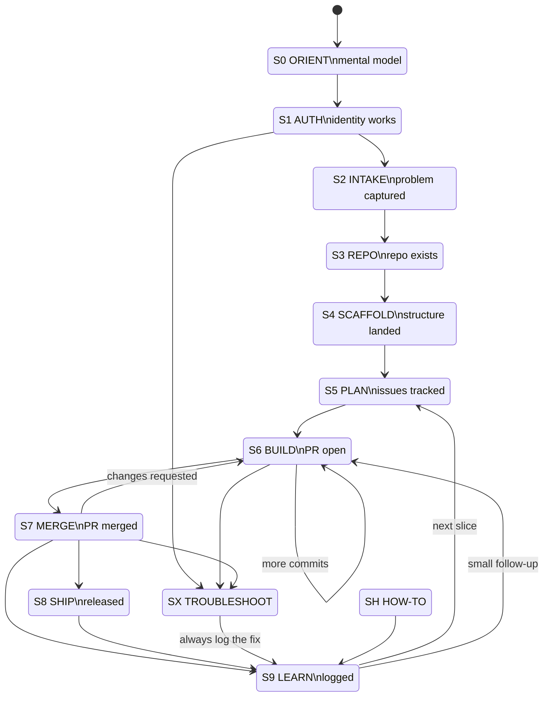

# The Harness Graph

The skill is a state machine. This file is the authority on transitions. Read it
when you are unsure which state you are in or what must be true to leave one.

## Mermaid



## Transition table

| From | To | Trigger | Must be true to leave (exit condition) |
|---|---|---|---|
| — | S0 | No `.pmops/state.json`, PM is new to GitHub | PM can define repo/branch/commit/PR in product terms |
| S0 | S1 | Orientation given | — |
| S1 | S2 | Identity confirmed | `gh api user` (or `get_me`) returns the PM's handle; `git config user.email` set |
| S2 | S3 | Core Five answered or assumed | A written problem statement or PRD exists on disk |
| S3 | S4 | Repo created | Repo URL exists, cloned locally, default branch has a commit |
| S4 | S5 | Scaffold PR merged | `README.md`, `.github/`, `docs/`, `.pmops/state.json` present on default branch |
| S5 | S6 | Work is sliced | At least one issue with acceptance criteria, attached to a milestone |
| S6 | S7 | Change pushed | PR open, body filled from template, CI triggered |
| S7 | S8 | PR merged | Branch merged and deleted; linked issue closed |
| S7 | S6 | Reviewer requested changes | — |
| S7 | S9 | Merged, nothing to ship yet | — |
| S8 | S9 | Release published | Tag + changelog entry exist; rollback path stated |
| S9 | S5/S6 | Loop closes | Entry appended to `learning/LEARNING-LOG.md` |
| any | SX | An error or scary output | Root cause named, fix applied, logged in S9 |
| any | SH | PM asks to be taught | Answer given in <150 words with the exact command |

## Skipping states

Skipping is allowed and normal — a PM who already has a repo enters at S5 or S6.
The only two states you may **never** skip:

- **S1 AUTH**, because everything downstream fails silently or confusingly without it.
- **S9 LEARN**, because it is the only thing that makes the next loop cheaper.

## State file shape

`.pmops/state.json`, at the repo root:

```json
{
  "version": 1,
  "project": "checkout-redesign",
  "state": "S6",
  "updated": "2026-08-17T09:31:00Z",
  "history": [
    {"state": "S3", "at": "2026-08-15T11:02:00Z", "note": "created repo acme/checkout-redesign"},
    {"state": "S4", "at": "2026-08-15T11:40:00Z", "note": "scaffold PR #1 merged"}
  ],
  "artifacts": {
    "repo": "https://github.com/acme/checkout-redesign",
    "prd": "docs/product/prd-checkout-redesign.md",
    "milestone": "M1 — Guest checkout",
    "open_pr": "https://github.com/acme/checkout-redesign/pull/12"
  }
}
```

Read it at the start of every session. Write it at the end of every state. If it
disagrees with reality (the PR is already merged, the repo moved), reality wins —
correct the file and say so.
