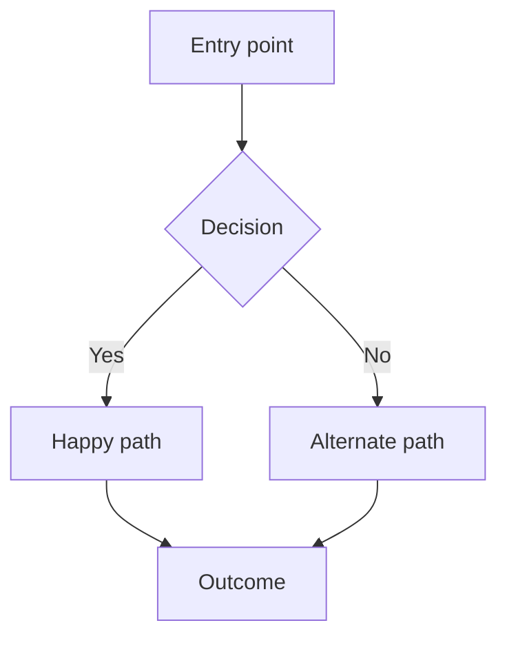

# PRD — {{PROJECT_NAME}}

| | |
|---|---|
| **Status** | Draft · In review · Approved · Shipped · Archived |
| **Owner** | @{{OWNER}} |
| **Last updated** | {{DATE}} |
| **Milestone** | {{MILESTONE}} |
| **Related** | Issues: · Design: · Research: |

> Markers used in this doc: `⚠️ NEEDS INPUT:` = a human must answer ·
> `ASSUMPTION:` = drafted, please confirm or correct · `TODO(@handle):` = someone owes something.

---

## 1. Problem

*Who hurts, how, and how much. Two to four sentences. No solution language.*

{{PROBLEM}}

**Evidence** — what makes this real rather than suspected:
- Data:
- User quotes:
- Support/sales signal:

**What people do today instead** (the current workaround, and what it costs them):

## 2. Who this is for

**Primary user:**
**Secondary:**
**Explicitly not for:**

*If you can't name who this is NOT for, the scope isn't defined yet.*

## 3. Why now

*Why this, this quarter, ahead of everything else. What changed, or what breaks if it waits.*

## 4. Outcome & success

**If this works:**

| Metric | Today | Target | How measured | By when |
|---|---|---|---|---|
| | | | | |

**Counter-metric** *(what must NOT get worse — the guardrail that stops a local win from becoming a global loss)*:

**Kill criteria** *(what would make us stop)*:

## 5. Scope

### In scope
- 

### Non-goals
*The highest-value section in this document. Be specific and slightly uncomfortable.*
- 

### Later (explicitly deferred, not forgotten)
- 

## 6. The experience

*What a user does, step by step. Written before any technical design.*

1. 
2. 
3. 

**Key states to handle:** empty · loading · error · success · edge cases

## 7. Requirements

| # | Requirement | Priority | Acceptance criteria |
|---|---|---|---|
| R1 | | Must | |
| R2 | | Should | |
| R3 | | Could | |

*Must = ship blocker. Should = ship without it only under protest. Could = nice.*

## 8. Open questions & risks

| Question / risk | Impact if wrong | Owner | Resolve by |
|---|---|---|---|
| | | | |

## 9. Dependencies

| On whom / what | For what | Confirmed? |
|---|---|---|
| | | |

## 10. Rollout

**Approach:** internal → beta cohort → % rollout → GA
**Gate between stages:**
**Rollback plan:**
**Who needs to be told before users see it:**

## 11. Decisions made along the way

*Link to `docs/decisions/` ADRs. Don't re-litigate settled choices in this doc.*

| Date | Decision | ADR |
|---|---|---|
| | | |

---

## Appendix — review checklist

Before moving this out of Draft:

- [ ] The problem is stated without naming the solution
- [ ] There is evidence, not just conviction
- [ ] Non-goals are written and specific
- [ ] Every requirement has acceptance criteria
- [ ] There is a counter-metric
- [ ] Someone who wasn't in the room could build from this
- [ ] Every `⚠️ NEEDS INPUT` is resolved or consciously accepted
